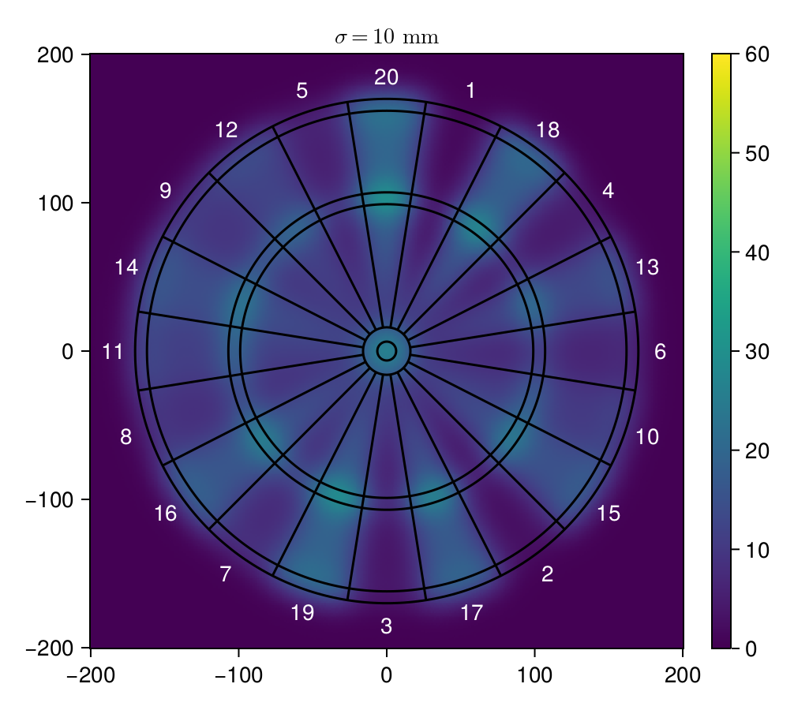

# Dart.jl

Monte Carlo simulation of throws on a dart board.

Assumptions:

- Each throw is independent
- No bias in throwing
- Each throw follows a multivariate distribution with covariance matrix
  [σ^2, 0; 0, σ^2]

## Results

10000 samples were taken for each point in the grid.




## Try it yourself

Clone this repository:

```sh
git clone https://github.com/matthias-michalek/dart.git
cd dart
```

Run Julia:

```julia
# Activate environment
using Pkg
Pkg.activate(".")
Pkg.instantiate()
using Dart

# Sample 400 points from -200 to 200 in each dimension.
xs = range(-200, 200, 400)
ys = range(-200, 200, 400)

# For each point simulate 1000 throws.
# Use covariance matrix [5^2 0; 0 5^2].
zs = expectation_values(xs, ys, [5^2 0; 0 5^2], 1000)

# Plot result
f = draw_heatmap(xs, ys, zs)
```

## Further improvements:

- [ ] parallelize Code
